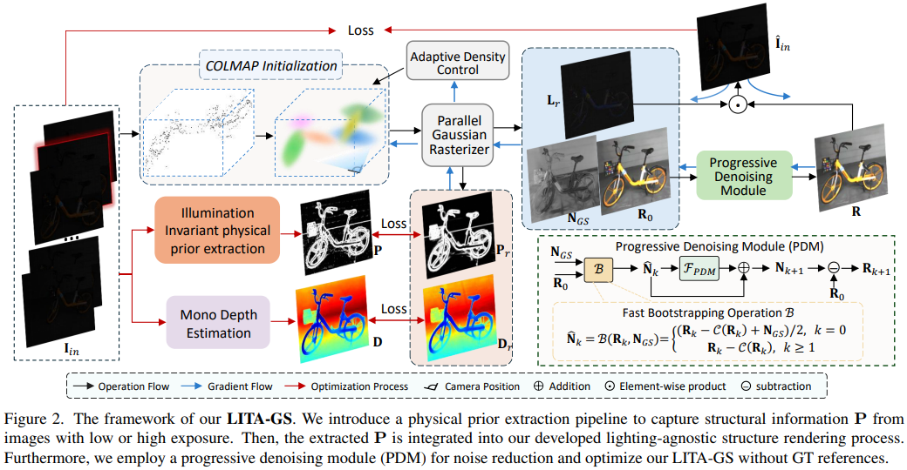

#  [CVPR 2025] LITA-GS: Illumination-Agnostic Novel View Synthesis via Reference-Free 3D Gaussian Splatting and Physical Priors [[Paper]](https://arxiv.org/pdf/2504.00219)

<h4 align="center"> Han Zhou, Wei Dong&dagger;, Jun Chen

<h4 align="center"> McMaster University, &dagger;Corresponding Author

  
### Introduction
This repository represents the official implementation of our CVPR 2025 paper titled **LITA-GS: Illumination-Agnostic Novel View Synthesis via Reference-Free 3D Gaussian Splatting and Physical Priors**. If you find this repo useful, please give it a star ⭐ and consider citing our paper in your research. Thank you for your interest. 

## 📢 News
**2025-06-12** We strat to update this repo from today, and we plan to make it complete within one week!

### Overall Framework

